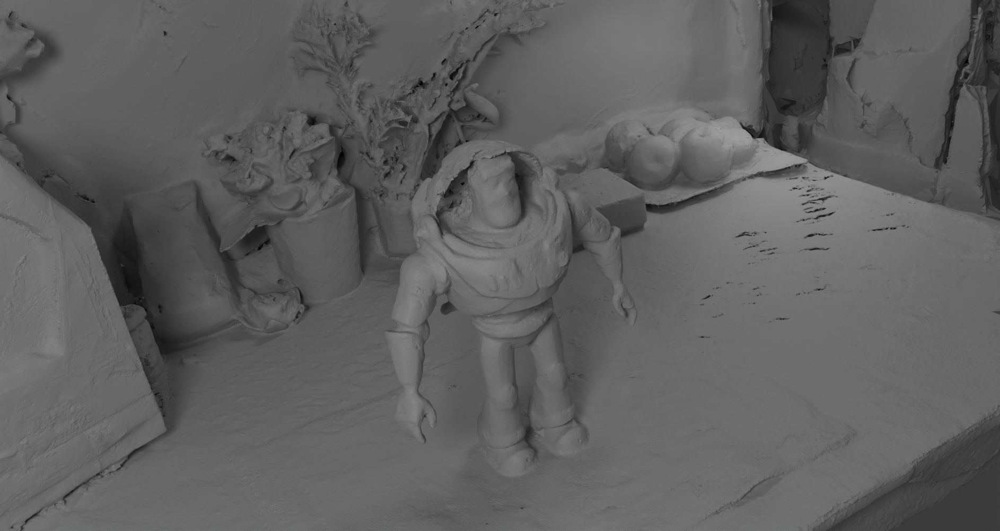
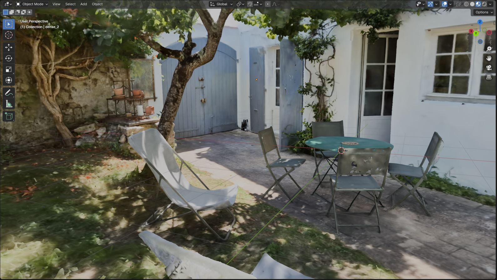
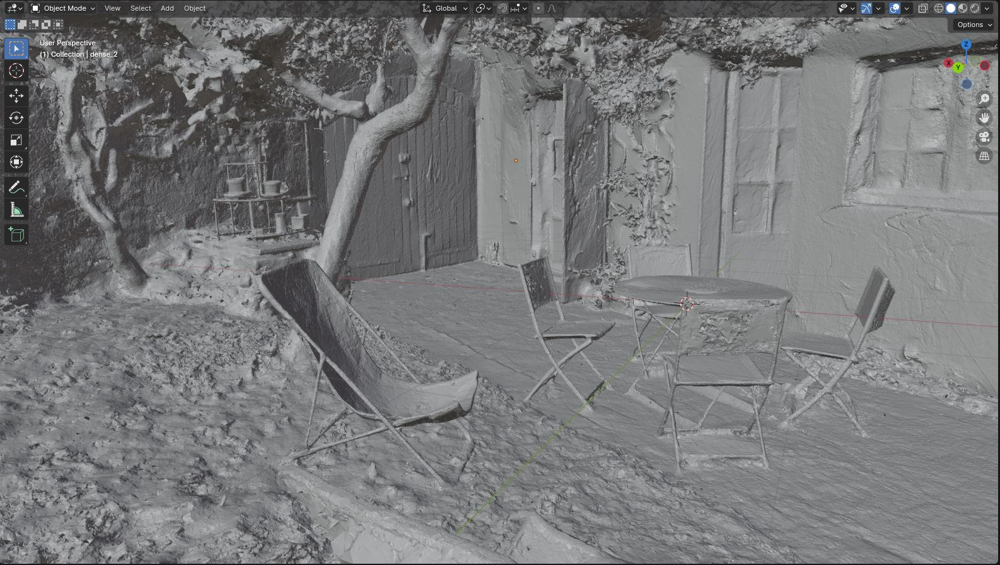
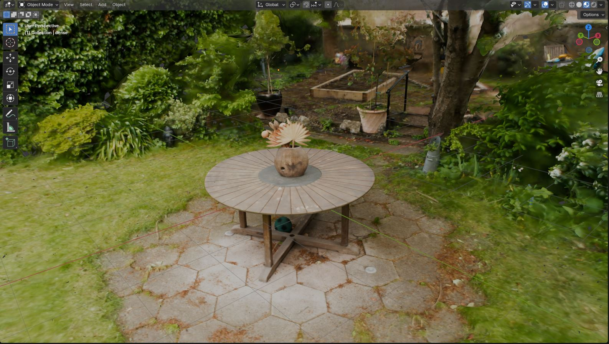
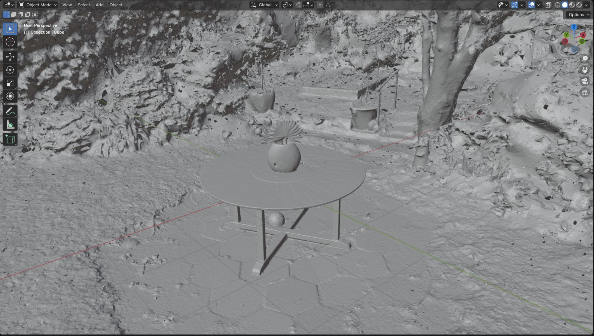
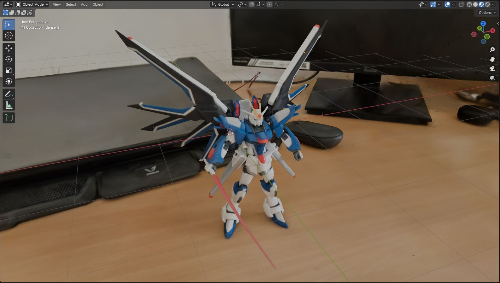
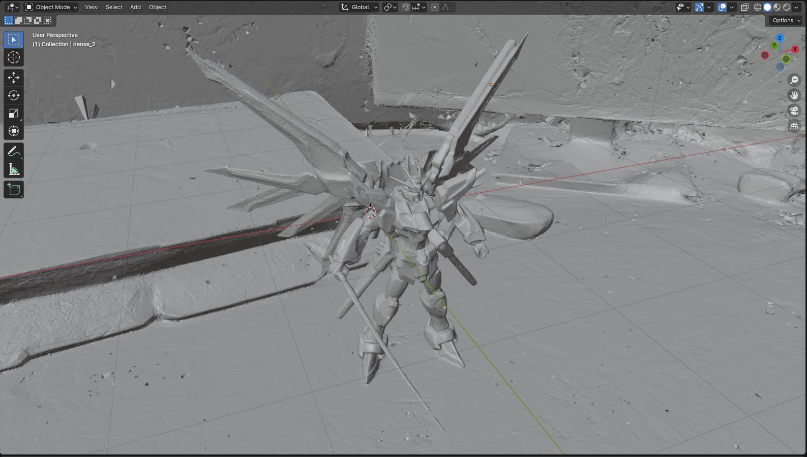
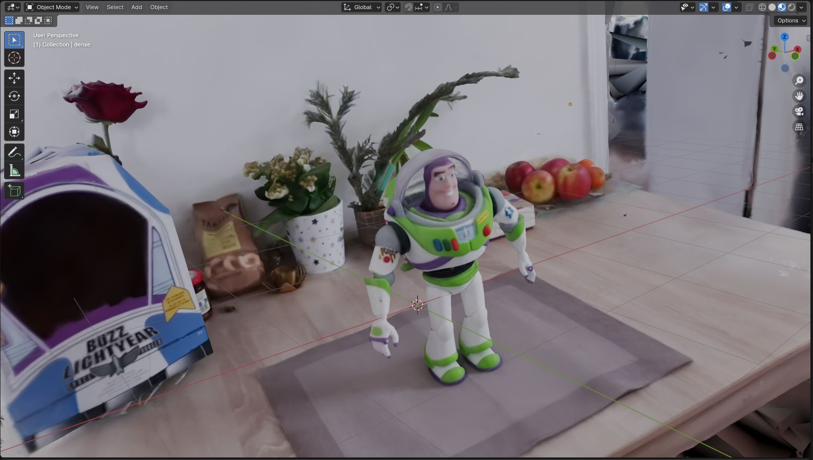
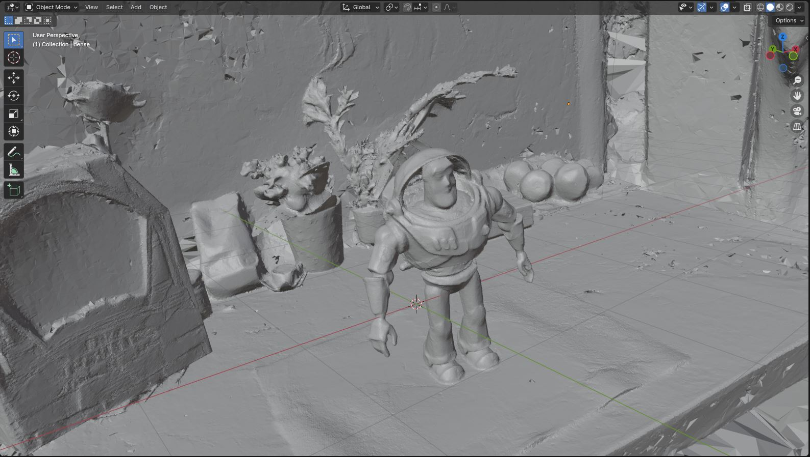

<div align="center">

# MAtCha Gaussians: Atlas of Charts for High-Quality Geometry and Photorealism From Sparse Views

<font size="4">
CVPR 2025
</font>
<br>

<font size="4">
<a href="https://anttwo.github.io/" style="font-size:100%;">Antoine Guédon<sup>1</sup></a>&emsp;
<a href="https://scholar.google.com/citations?user=-LzEJVwAAAAJ&hl=en" style="font-size:100%;">Tomoki Ichikawa<sup>2</sup></a>&emsp;
<a href="https://kyamashita5.github.io/" style="font-size:100%;">Kohei Yamashita<sup>2</sup></a>&emsp;
<a href="https://vision.ist.i.kyoto-u.ac.jp/" style="font-size:100%;">Ko Nishino<sup>2</sup></a>&emsp;
</font>
<br>

<font size="4">
<sup>1</sup>LIGM, Ecole des Ponts, Univ Gustave Eiffel, CNRS<br>
<sup>2</sup>Graduate School of Informatics, Kyoto University, Japan
</font>

| <a href="https://anttwo.github.io/matcha/">Webpage</a> | <a href="https://arxiv.org/abs/2412.06767">arXiv</a> |

<!--  <br> -->
 <br>
<b>
MAtCha Gaussians reconstruction from 10 input views.<br><br>
</b>
<b> We propose MAtCha Gaussians, a novel surface representation for reconstructing high-quality 3D meshes with photorealistic rendering from sparse-view (or dense-view) images. Our key idea is to model the underlying scene geometry as an Atlas of Charts which we refine with <a href="https://surfsplatting.github.io/">2D Gaussian surfels</a>. We initialize the charts with a <a href="https://depth-anything-v2.github.io/">monocular depth estimation model</a> and refine them using differentiable Gaussian rendering and a lightweight neural chart deformation model. Combined with a sparse-view SfM model like <a href="https://europe.naverlabs.com/research/publications/mast3r-sfm-a-fully-integrated-solution-for-unconstrained-structure-from-motion/">MASt3R-SfM</a>, MAtCha can recover sharp and accurate surface meshes of both foreground and background objects in unbounded scenes within minutes, only from a few unposed RGB images.</b>
</div>

This repository proposes the following key elements:
- **Optimization robust to sparse-view inputs:** Our novel initialization/optimization pipeline is robust to sparse-view inputs (as few as 3 to 10 images) but also scales to dense-view scenarios (hundreds of views). No more choosing between sparse or dense methods!
- **Scalable mesh extraction method:** We developed a new mesh extraction method that properly handles both foreground and background geometry while being lightweight (only 150-350MB), without any post-processing mesh decimation.
- **Novel depth regularization:** We also introduce a novel regularization loss that leverages depth maps estimated with a monocular depth estimator (which can be multi-view inconsistent or have inaccurate scale) to achieve smooth, detailed background geometry while preserving very sharp foreground details.

<!-- ## Abstract

_We present a novel appearance model that simultaneously realizes explicit high-quality 3D surface mesh recovery and photorealistic novel view synthesis from sparse view samples.
Our key idea is to model the underlying scene geometry Mesh as an Atlas of Charts which we render with 2D Gaussian surfels (MAtCha Gaussians).
MAtCha distills high-frequency scene surface details from an off-the-shelf monocular depth estimator and refines it through <a href="https://surfsplatting.github.io/">2D Gaussian surfel rendering</a>. The Gaussian surfels are attached to the charts on the fly, satisfying photorealism of neural volumetric rendering and crisp geometry of a mesh model, i.e., two seemingly contradicting goals in a single model.
At the core of MAtCha lies a novel neural deformation model and a structure loss that preserve the fine surface details distilled from learned monocular depths while addressing their fundamental scale ambiguities.
Results of extensive experimental validation demonstrate MAtCha's state-of-the-art quality of surface reconstruction and photorealism on-par with top contenders but with dramatic reduction in the number of input views and computational time.
We believe MAtCha will serve as a foundational tool for any visual application in vision, graphics, and robotics that require explicit geometry in addition to photorealism._ -->


## BibTeX

```
@article{guedon2025matcha,
 title={MAtCha Gaussians: Atlas of Charts for High-Quality Geometry and Photorealism From Sparse Views},
 author={Gu{\'e}don, Antoine and Ichikawa, Tomoki and Yamashita, Kohei and Nishino, Ko},
 journal={CVPR},
 year={2025}
}
```

## Updates and To-do list

<details>
<summary><span style="font-weight: bold;">Updates</span></summary>
<ul>
  <li><b>[04/02/2025]</b> Code release.</li>
</ul>
</details><br>

<details>
<summary><span style="font-weight: bold;">To-do list</span></summary>
<ul>
  <li><b>Initial charts selection:</b> For dense-view reconstruction, add a script to automatically select a good subset of images to convert into initial charts. The initial charts just need to cover the scene well, so a simple greedy approach should be sufficient.</li>
  <li><b>Evaluation:</b> Add evaluation scripts.</li>
  <li><b>gsplat support:</b> Make the code compatible with gsplat's rasterizer from the Nerfstudio team.</li>
</ul>
</details>

## Overview

The full MAtCha pipeline consists of 4 steps:
1. **Scene initialization**: Camera poses are estimated from a sparse set of images using <a href="https://europe.naverlabs.com/research/publications/mast3r-sfm-a-fully-integrated-solution-for-unconstrained-structure-from-motion/">MASt3R-SfM</a>. Images can be unposed or posed. For posed images, a COLMAP dataset with ground truth camera poses can be provided to the pipeline. For COLMAP datasets, MAtCha can use either sparse or dense viewpoints.
2. **Chart Alignment**: Each input image is converted into an optimizable chart. We first initialize the charts with <a href="https://depth-anything-v2.github.io/">DepthAnythingV2</a>. Then, we use a novel neural deformation model to align the chart with the scene geometry and produce a multi-view consistent, coherent manifold.
3. **Chart refinement**: We further refine and densify the geometry with a photometric optimization. To this end, we instantiate <a href="https://surfsplatting.github.io/">2D Gaussians</a> aligned with the manifold and optimize the representation with differentiable rendering. Gaussians can densify along the manifold to better capture the fine details of the scene.
4. **Mesh extraction**: We propose a novel mesh extraction method that relies on a depth fusion algorithm and an adaptive tetrahedralization of the scene. Our mesh extraction method scales to large scenes with background objects, allowing for a much more flexible and adaptive mesh with detailed foreground objects and smooth background geometry.

We provide a dedicated script for each of these steps, as well as a script `train.py` that runs the entire pipeline. We explain how to use this script in the next sections. <br>

<div align="center">

<br>


<br><b>Examples of MAtCha reconstructions from 10 input views. MAtCha can recover sharp, accurate and complete 3D surface meshes from sparse views, including both foreground and background objects (left: GT images, right: MAtCha mesh).</b><br>
</div><br>

<div align="center">

<br>

<br>

<br>


<br><b>Examples of MAtCha reconstructions from dense input views (150+ training views). MAtCha can fully leverage priors from monocular depth estimation models, even when the predicted depth maps are not multi-view consistent, and recover sharp and complete  meshes including both foreground and background objects (left: textured mesh, right: untextured mesh).</b><br>
</div><br>

## License

<details>
<summary><span style="font-weight: bold;">Click here to see content.</span></summary>

This project builds on existing open-source implementations of the following projects:
- <a href="https://github.com/naver/mast3r/tree/mast3r_sfm">MASt3R-SfM</a>
- <a href="https://github.com/DepthAnything/Depth-Anything-V2">DepthAnythingV2</a>
- <a href="https://github.com/hbb1/2d-gaussian-splatting">2D Gaussian Splatting</a>
- <a href="https://github.com/autonomousvision/gaussian-opacity-fields">Gaussian Opacity Fields</a>

As a consequence, this project contains some code from the above projects, specifically in the `./mast3r/`, `./Depth-Anything-V2/`, and `./2d-gaussian-splatting/` directories.

Please refer to the LICENSE files in the respective directories for more details about the license of these specific parts of the code, most of them being incompatible with commercial use.

Apart from these parts, the rest of the code was entirely written by ourselves and is licensed under the MIT license (see the LICENSE file in the root directory). As a consequence, you are free to use this code for any purpose, commercial or non-commercial.

**Note for commercial use:** If you intend to use this project for commercial purposes, you would need to replace the components with non-commercial licenses with alternatives that permit commercial use.

</details>

## Installation

<details>
<summary><span style="font-weight: bold;">Click here to see content.</span></summary>

### 0. Requirements

The software requirements are the following:
- Conda (recommended for easy setup)
- C++ Compiler for PyTorch extensions
- CUDA toolkit 11.8 for PyTorch extensions
- C++ Compiler and CUDA SDK must be compatible

Please refer to the original <a href="https://surfsplatting.github.io/">2D Gaussian Splatting repository</a> for more details about requirements.

### 1. Quick install

Please start by cloning the repository:

```shell
git clone https://github.com/anttwo/MAtCha.git
cd MAtCha
```

Then, we provide a script to install all the dependencies for the MAtCha pipeline, as well as a script to download the weights of the pretrained models needed for running the full MAtCha pipeline (<a href="https://github.com/naver/mast3r/tree/mast3r_sfm">MASt3R-SfM</a> and <a href="https://github.com/DepthAnything/Depth-Anything-V2">DepthAnythingV2</a>).

To create the conda environment and install all the dependencies, run:

```shell
python install.py
```

By default, the environment will be named `matcha`. You can change the name of the environment with the `--env_name` argument.

To download all the pretrained models, run:

```shell
python download_checkpoints.py
```

If you encounter any issues when running the installation script, please refer to the following section for detailed instructions.

### 2. Detailed installation (if quick install fails)

<details>
<summary><span style="font-weight: bold;">Click here to see content.</span></summary>

#### 2.1. Install dependencies

Please follow the instructions below to install the dependencies manually:

```shell
conda create --name matcha -y python=3.9
conda activate matcha
# Choose the right CUDA version for your system
conda install pytorch==2.0.1 torchvision==0.15.2 torchaudio==2.0.2 pytorch-cuda=11.8 -c pytorch -c nvidia
conda install -c fvcore -c iopath -c conda-forge fvcore iopath
conda install pytorch3d==0.7.4 -c pytorch3d
conda install -c plotly plotly
conda install -c conda-forge rich
conda install -c conda-forge plyfile==0.8.1
conda install -c conda-forge jupyterlab
conda install -c conda-forge nodejs
conda install -c conda-forge ipywidgets
conda install cmake
conda install conda-forge::gmp
conda install conda-forge::cgal
pip install roma==1.5.0
pip install open3d==0.18.0
pip install opencv-python==4.11.0.86
pip install scipy==1.13.1
pip install einops==0.8.1
pip install trimesh==4.6.4
pip install pyglet==1.5.29
pip install tensorboard
pip install scikit-learn==1.6.1
pip install cython==3.0.12
# Choose the right CUDA version for your system
pip install faiss-gpu-cu11
pip install tqdm==4.67.1
pip install matplotlib==3.9.4
pip install huggingface-hub[torch]
pip install gradio
```

Then, install the 2D Gaussian splatting and adaptive tetrahedralization dependencies:

```shell
cd 2d-gaussian-splatting/submodules/diff-surfel-rasterization
pip install -e .
cd ../simple-knn
pip install -e .
cd ../tetra-triangulation
cmake .
# you can specify your own cuda path
export CPATH=/usr/local/cuda-11.8/targets/x86_64-linux/include:$CPATH
export LD_LIBRARY_PATH=/usr/local/cuda-11.8/targets/x86_64-linux/lib:$LD_LIBRARY_PATH
export PATH=/usr/local/cuda-11.8/bin:$PATH
make 
pip install -e .
cd ../../../
```

Finally, install the MASt3R-SfM dependencies:

```shell
cd mast3r/asmk/cython
cythonize *.pyx
cd ..
pip install .
cd ..
cd ../dust3r/croco/models/curope/
python setup.py build_ext --inplace
cd ../../../../../
```


#### 2.2. Download pretrained models

Start by downloading a pretrained checkpoint for DepthAnythingV2. Several encoder sizes are available; We recommend using the `large` encoder:

```shell
mkdir -p ./Depth-Anything-V2/checkpoints/
wget https://huggingface.co/depth-anything/Depth-Anything-V2-Large/resolve/main/depth_anything_v2_vitl.pth -P ./Depth-Anything-V2/checkpoints/
```

Then, download the MASt3R-SfM checkpoint:

```shell
mkdir -p ./mast3r/checkpoints/
wget https://download.europe.naverlabs.com/ComputerVision/MASt3R/MASt3R_ViTLarge_BaseDecoder_512_catmlpdpt_metric.pth -P ./mast3r/checkpoints/
```

And finally, download the MASt3R-SfM retrieval checkpoint:

```shell
wget https://download.europe.naverlabs.com/ComputerVision/MASt3R/MASt3R_ViTLarge_BaseDecoder_512_catmlpdpt_metric_retrieval_trainingfree.pth -P ./mast3r/checkpoints/
wget https://download.europe.naverlabs.com/ComputerVision/MASt3R/MASt3R_ViTLarge_BaseDecoder_512_catmlpdpt_metric_retrieval_codebook.pkl -P ./mast3r/checkpoints/
```

</details>

</details>

## Quick Start

<details>
<summary><span style="font-weight: bold;">Click here to see content.</span></summary>

This section describes how to run the full MAtCha pipeline on a set of unposed or posed images, with either sparse or dense supervision. For running only specific steps of the pipeline, please refer to the following section. Please make sure to first activate the conda environment created by the installation script:

```shell
conda activate matcha
```

<!-- ### Training on unposed images -->

<br>
<details>
<summary><span style="font-weight: bold;">Training on unposed images with sparse supervision</span></summary>

You can run the following single script to optimize a full MAtCha model using a set of unposed images. By default, all images in the directory will be used:

```shell
python train.py -s <PATH TO IMAGE DIRECTORY> -o <PATH TO OUTPUT DIRECTORY> --sfm_config unposed
```

You can select a subset of images to use for the optimization. To this end, you can either use the `--image_idx` argument to select a specific subset of images by index, or the `--n_images` argument to select a fixed number of images. If using the `--n_images` argument, the images will be sampled with constant spacing; You can add the `--randomize_images` argument to shuffle the images before sampling.

To use a specific subset of images (such as the first 5 images in the directory), you can run:
```shell
python train.py -s <PATH TO IMAGE DIRECTORY> -o <PATH TO OUTPUT DIRECTORY> --sfm_config unposed --image_idx 0 1 2 3 4
```

To use 10 images sampled with constant spacing in the directory, you can run:
```shell
python train.py -s <PATH TO IMAGE DIRECTORY> -o <PATH TO OUTPUT DIRECTORY> --sfm_config unposed --n_images 10
```

To use 10 images randomly sampled in the directory, you can run:
```shell
python train.py -s <PATH TO IMAGE DIRECTORY> -o <PATH TO OUTPUT DIRECTORY> --sfm_config unposed --n_images 10 --randomize_images
```

</details>

<!-- ### Training on posed images (COLMAP dataset) with sparse supervision -->
<br>
<details>
<summary><span style="font-weight: bold;">Training on COLMAP dataset with sparse supervision</span></summary>

You can also provide a usual COLMAP dataset with ground truth camera poses to MAtCha by using the `--sfm_config posed` argument. In this case, as COLMAP datasets may contain a large number of images, make sure to provide the indices of the images to use for the optimization with the `--image_idx` argument, or to use the `--n_images` argument. For instance, to use only the first 5 images for sparse-view reconstruction, you can run:

```shell
python train.py -s <PATH TO COLMAP DATASET> -o <PATH TO OUTPUT DIRECTORY> --sfm_config posed --image_idx 0 1 2 3 4
```

You can create a COLMAP dataset from a set of images using the script `2d-gaussian-splatting/convert.py`. Please refer to the repo of our previous work <a href="https://github.com/Anttwo/SuGaR">SuGaR</a> or the <a href="https://github.com/graphdeco-inria/gaussian-splatting">original 3DGS repo</a> for more details on how to do this.

</details>

<!-- ### Training on posed images (COLMAP dataset) with dense supervision -->
<br>
<details>
<summary><span style="font-weight: bold;">Training on COLMAP dataset with dense supervision</span></summary>

You can also provide a usual COLMAP dataset with ground truth camera poses and dense viewpoints to MAtCha by using both the `--sfm_config posed` and `--dense_supervision` arguments. 
In this case, a subset of images will first be converted into charts for building an initial manifold; The manifold will then be used as a scaffold for optimizing the full model with dense supervision, using all the images in the dataset. We recommend selecting a subset of images with good coverage of the scene for building the initial charts.

We also provide a novel loss function for regularizing the representation using depth maps for all viewpoints obtained with a monocular depth estimator. Our novel loss function enforces the rendered depth maps to preserve the same depth order as the supervision depth maps; As a result, it does not require supervision depth maps to be multi-view consistent and does not require any additional alignment or rescaling of the depth maps. 

You do not need to provide the supervision depth maps to the pipeline, as our code will automatically use DepthAnythingV2 to generate them.

Make sure to provide the indices of the images to use as initial charts with the `--image_idx` argument, or to use the `--n_images` argument. For instance, to use 10 images with constant spacing as initial charts for dense-view reconstruction, you can run:

```shell
python train.py -s <PATH TO COLMAP DATASET> -o <PATH TO OUTPUT DIRECTORY> --sfm_config posed --dense_supervision --n_images 10
```

By default, the train.py script will optimize the model for 30,000 iterations when using dense supervision, instead of the default 7,000 iterations used for sparse-view reconstruction. You can change this behavior by using the argument `--free_gaussians_config default` to optimize for 7,000 iterations, or `--free_gaussians_config long` to optimize for 30,000 iterations. 
While optimizing for 30,000 iterations will take approximately 50 minutes in total, optimizing for 7,000 iterations will take a few minutes only. However, for dense-view reconstruction, we recommend optimizing for 30,000 iterations to ensure optimal quality.

</details>

<br>
<details>
<summary><span style="font-weight: bold;">Running specific steps of the pipeline</span></summary>

You can run only one specific step of the pipeline by using one of the following arguments with the `train.py` script:

- `--sfm_only`: Only run the scene initialization using MASt3R-SfM.
- `--alignment_only`: Only run the chart alignment using our novel neural deformation model.
- `--refinement_only`: Only run the chart refinement using 2D Gaussians.
- `--mesh_only`: Only run the mesh extraction relying on our custom and scalable depth fusion algorithm.

Running a specific step can be useful for experimenting with different hyperparameters, adjusting the strength of the regularization during chart alignment and refinement, trying different resolution for extracting the final mesh, etc.

You can also combine several of these arguments to run several specific steps in a single run.

The full training script `train.py` is just a wrapper around individual scripts located in the `./scripts/` directory; Please refer to these scripts for more details on how to use them as well as the different arguments.

</details>

<!-- ### Stronger regularization for removing floaters -->
<br>
<details>
<summary><span style="font-weight: bold;">Stronger regularization for removing floaters</span></summary>

If some artifacts or floaters are present in the final mesh, you can try to increase the strength of the chart alignment with `--alignment_config strong`:

```shell
python train.py -s <PATH TO IMAGE DIRECTORY> -o <PATH TO OUTPUT DIRECTORY> --sfm_config unposed --n_images 10 --alignment_config strong
```

If using a COLMAP dataset with dense supervision, you can also adjust the strength of the dense depth regularization with the `--dense_regul` argument: 

- Use `--dense_regul default` for the default regularization
- Use `--dense_regul strong` for a stronger regularization
- Use `--dense_regul weak` for a weaker regularization
- Use `--dense_regul none` to disable the dense regularization.

Increasing the strength of the dense depth regularization can help removing floaters. For some specific scenes where GT camera poses or monocular depth maps could be inaccurate and contain outliers, the dense depth regularization could be detrimental; In this case, you can also try to weaken or disable the dense depth regularization.

For instance, to use 10 initial charts generated from 10 images with constant spacing and perform dense-view reconstruction with a stronger dense depth regularization, you can run:

```shell
python train.py -s <PATH TO COLMAP DATASET> -o <PATH TO OUTPUT DIRECTORY> --sfm_config posed --dense_supervision --n_images 10 --dense_regul strong
```

</details>

<!-- ### Mesh extraction -->
<br>
<details>
<summary><span style="font-weight: bold;">Improve Mesh Quality</span></summary>

Our novel mesh extraction method relies on a custom depth fusion algorithm. To scale our method to large scenes with background objects, we adapted the adaptive tetrahedralization method from <a href="https://niujinshuchong.github.io/gaussian-opacity-fields/">Gaussian Opacity Fields (GOF)</a>: We partition the scene into a set of tetrahedra, such that the local number of tetrahedra directly depends on the local distribution of Gaussians in the scene. This allows for a much more flexible and adaptive mesh with both detailed foreground objects and smooth background geometry.

For dense-view reconstruction, we iterate over all training viewpoints to extract the final mesh.

For sparse-view reconstruction, we linearly interpolate pseudo-viewpoints between the neighboring sparse training viewpoints to extract the final mesh. However, in some cases, interpolating pseudo-viewpoints could lead to artifacts in the mesh, especially if interpolated viewpoints end up being inside the geometry.

If encountering such artifacts, you can try to disable the interpolation with the `--no_interpolated_views` argument:

```shell
python train.py -s <PATH TO IMAGE DIRECTORY> -o <PATH TO OUTPUT DIRECTORY> --sfm_config unposed --n_images 10 --no_interpolated_views
```

Please note that we also propose a multi-resolution TSDF fusion method that can be used instead of the adaptive tetrahedralization method. While this method is closer to concurrent works, it may produce artifacts or large holes in the mesh; As a result, we strongly recommend using the adaptive tetrahedralization method for better quality meshes. For using the multi-resolution TSDF fusion method, you can use the `--use_multires_tsdf` argument:

```shell
python train.py -s <PATH TO IMAGE DIRECTORY> -o <PATH TO OUTPUT DIRECTORY> --sfm_config unposed --n_images 10 --use_multires_tsdf
```

</details>

<br>
<details>
<summary><span style="font-weight: bold;">Control the resolution of the final mesh</span></summary>

When using the adaptive tetrahedralization method, you can control the downsampling ratio of the tetrahedra set with the `--tetra_downsample_ratio` argument. This parameter directly controls the number of vertices in the final mesh.

We recommend starting with the default value of `--tetra_downsample_ratio 0.5` and then decreasing to `0.25` if the mesh is too dense, or increasing to `1.0` if the mesh is too sparse.

For example, to use a downsampling ratio of `0.25` with a dataset of unposed images, you can run:

```shell
python train.py -s <PATH TO IMAGE DIRECTORY> -o <PATH TO OUTPUT DIRECTORY> --sfm_config unposed --tetra_downsample_ratio 0.25
```

</details>

<br>

Please refer to the `train.py` script as well as individual scripts in the `./scripts/` directory for more details on the command line arguments. Feel free to modify the config files in the `./configs/` directory or create your own to suit your needs.

<!-- <details>
<summary><span style="font-weight: bold;">Please click here to see the most important arguments for the `train_full_pipeline.py` script.</span></summary>

| Parameter | Type | Description |
| :-------: | :--: | :---------: |
| `--scene_path` / `-s`   | `str` | Path to the source directory containing a COLMAP dataset.|
| `--gs_output_dir` | `str` | Path to the checkpoint directory of a vanilla 3D Gaussian Splatting model. If no path is provided, the script will start from scratch and first optimize a vanilla 3DGS model. |
| `--eval` | `bool` | If True, performs an evaluation split of the training images. Default is `False`. |
| `--regularization_type` / `-r` | `str` | Type of regularization to use for optimizing a Frosting. Can be `"dn_consistency"`, `"density"` or `"sdf"`. We recommend using the newer `"dn_consistency"` regularization for best quality meshes. |
| `--gaussians_in_frosting` | `int` | Number of Gaussians to use in the Frosting layer. Default is `2_000_000`. You can try with `5_000_000` Gaussians for optimal quality. |
| `--use_occlusion_culling` | `bool` | If True, uses occlusion culling for accelerating optimization and rendering. Sligthly impacts the quality of the rendering. Default is `False`. |
|`--poisson_depth` | `int` | Depth of the Poisson reconstruction for the mesh extraction. If `-1`, the depth is automatically computed using our heuristic described in the paper. Default is `-1`. You can try to reduce the depth if your mesh has holes or too many ellipsoidal bumps. |
| `--cleaning_quantile` | `float` | Quantile used for cleaning the mesh after Poisson reconstruction. Default is `0.1`. We recommend `0.1` for real scenes and `0.0` for single-object synthetic scenes. |
| `--connected_components_vis_th` | `int` | Threshold to use for removing non-visible connected components in the mesh. We recommend using `0.001` for real scenes and `0.5` for single-object synthetic scenes. Default is `0.001`. |
| `--low_poly` | `bool` | If True, uses the standard config for a low poly mesh, with `200_000` vertices. |
| `--high_poly` | `bool` | If True, uses the standard config for a high poly mesh, with `1_000_000` vertices. |
| `--refinement_time` | `str` | Default configs for time to spend on refinement. Can be `"short"` (2k iterations), `"medium"` (7k iterations) or `"long"` (15k iterations). |
| `--export_ply` | `bool` | If True, export a `.ply` file with the refined Frosting 3D Gaussians at the end of the training. This file can be large (+/- 500MB), but is needed for using a 3DGS viewer. Default is `True`. |
| `--export_obj` | `bool` | If True, will optimize and export a traditional textured mesh as an `.obj` file from the Frosting model. Computing a traditional color UV texture should just take a few seconds with Nvdiffrast. Default is `True`. |
| `--texture_square_size` | `int` | Size of the square allocated to each pair of triangles in the UV texture. Increase for higher texture resolution. Please decrease if you encounter memory issues. Default is `8`. |
|`--white_background` | `bool` | If True, the background of the images will be set to white. Default is `False`. |

</details> -->


</details>


## Evaluation

<details>
<summary><span style="font-weight: bold;">Click here to see content.</span></summary><br>

We will release the evaluation scripts soon, including:
- Surface reconstruction on DTU
- Surface reconstruction on Tanks and Temples
- Novel view synthesis on Mip-NeRF 360, Tanks and Temples and DeepBlending

We still need to clean the codebase a little bit and merge some scripts to make the full evaluation pipeline easier to run.

</details>


## Acknowledgements

We would like to thank the authors of the following projects for their awesome work, and for providing their code; This work would not have been possible without them.

- <a href="https://europe.naverlabs.com/research/publications/mast3r-sfm-a-fully-integrated-solution-for-unconstrained-structure-from-motion/">MASt3R-SfM</a>: We use the MASt3R-SfM pipeline to estimate camera poses and initial geometry from a set of images.
- <a href="https://depth-anything-v2.github.io/">DepthAnythingV2</a>: We use DepthAnythingV2 to initialize the charts.
- <a href="https://surfsplatting.github.io/">2D Gaussian Splatting</a>: We use 2D Gaussian Splatting to refine the charts with a differentiable renderer.
- <a href="https://niujinshuchong.github.io/gaussian-opacity-fields/">Gaussian Opacity Fields</a>: We adapted the tetrahedralization method from Gaussian Opacity Fields to extract a mesh from our representation.
